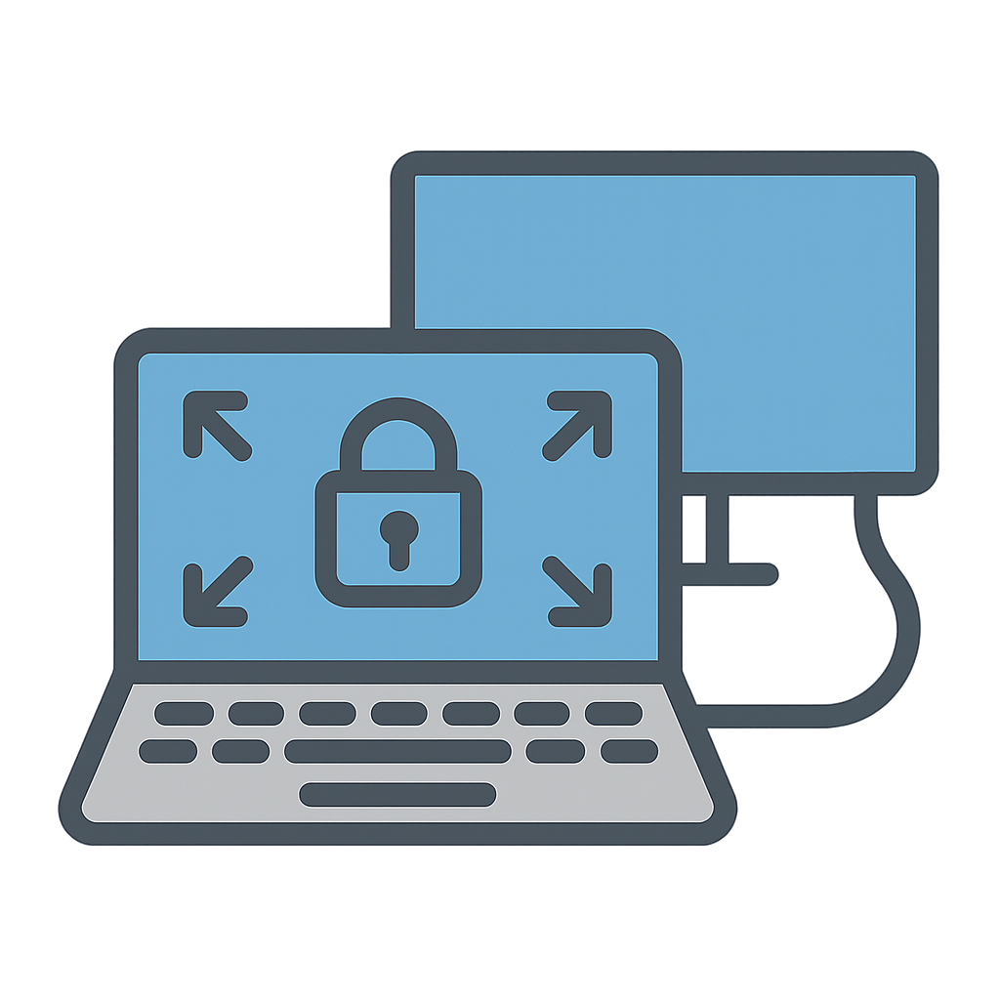

# DisplayWatcher

DisplayWatcher automatically monitors display connection changes on macOS and applies your custom `displayplacer` configuration instantly.



## Motivation

Every time I connect a new external display, macOS automatically changes the resolution of the built-in display, which is quite annoying. I wanted to detect display connection events and automatically restore the built-in display to my preferred resolution.

## Features

- Real-time external monitor detection via IOKit
- Automatically applies your preferred resolution using `displayplacer`
- Native macOS app bundle (`/Applications/DisplayWatcher.app`)
- Auto-starts on login (Login Items)

## Requirements

- macOS Monterey (12.0) or later
- Homebrew (https://brew.sh/)
- displayplacer (installed automatically)

## Installation

1. Clone this repository:

```bash
git clone https://github.com/ktym/displaywatcher.git
cd displaywatcher
```

2. Build the app:

```bash
./build.sh
```

3. Install:

```bash
./install.sh
```

4. Edit your configuration:

```
~/Library/Application Support/DisplayWatcher/displaywatcher.conf
```

To generate your desired display configuration, manually adjust your displays, then run:

```bash
displayplacer list | grep '^displayplacer "id:'
```

Copy the output into displaywatcher.conf.

## Notes

The installer will automatically build DisplayWatcher.app and register it as a Login Item for auto-start.
You can modify the displayplacer command anytime to adjust your desired resolution.

## Author

* Toshiaki Katayama ([@ktym](https://github.com/ktym/))
* ChatGPT

## License

MIT License


